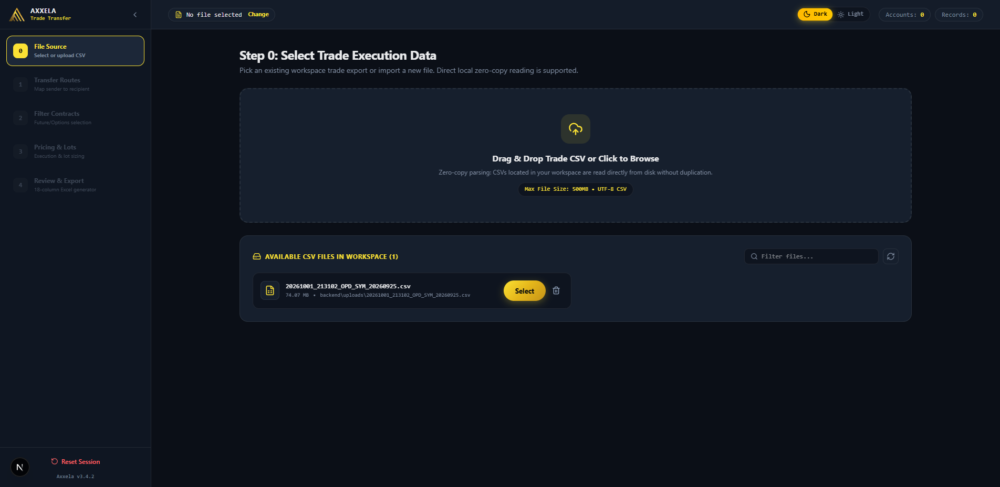
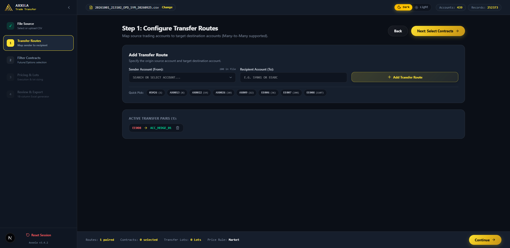
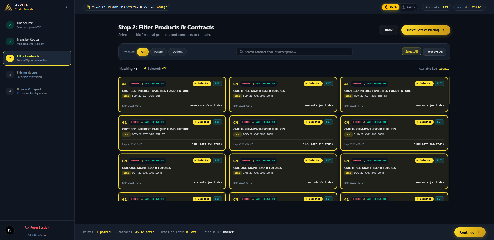
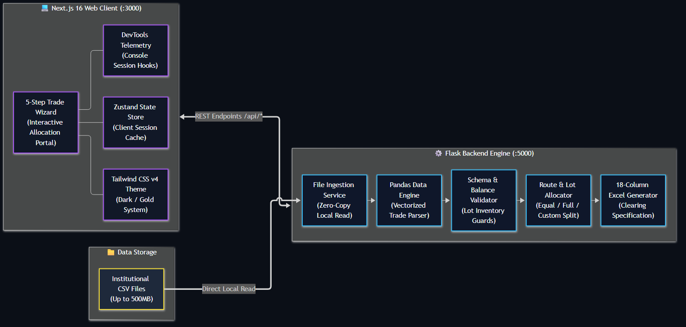

<div align="center">


# Axxela TTX — Trade Transfer

**Institutional Multi-Account Position Allocation**

[](https://nextjs.org/)
[](https://react.dev/)
[](https://www.typescriptlang.org/)
[](https://www.python.org/)
[](https://flask.palletsprojects.com/)
[](https://pandas.pydata.org/)
[](https://tailwindcss.com/)


</div>

---

## 📌 Overview

**Axxela TTX (Trade Transfer)** is an institutional-grade position transfer and lot allocation platform engineered for prop trading desks, hedge funds, clearing desks, and prime broker operations.

It streamlines complex post-trade operations: ingesting multi-megabyte institutional trade execution CSVs, validating schema integrity, defining sender-to-recipient account transfer routes, slicing contracts across Futures and Options, sizing allocations with granular balance guards, and exporting strictly formatted 18-column Excel clearing files.

---

## 🖥️ Platform UI Showcase

<div align="center">

### 1. Ingestion & Workspace Trade File Selection (Step 0)


<br/><br/>

### 2. Multi-Account Transfer Route Configuration (Step 1)


<br/><br/>

### 3. Derivative Contract Slicing & Instrument Selection (Step 2)


</div>

---

## ⚡ 5-Step Trade Transfer Wizard Workflow

### Step 0: File Source & Schema Validation
- **Zero-Copy Disk Loading**: Reads large trade export files (up to 500MB) directly from workspace disk storage without payload duplication.
- **Strict Schema Verification**: Automatically verifies required trading fields (`ContractCode`, `Account`, `Qty`, `Price`, `C/P`, `Strike`, `ExpDate`).
- **Workspace File Switcher**: Hot-switch between uploaded files and stored CSV batches with cached metadata.

### Step 1: Transfer Routes & Account Mapping
- **Sender-to-Recipient Pairing**: Map any number of source trading accounts to target holding/clearing accounts.
- **Auto-Discovery**: Extracts unique trading accounts from CSV execution headers.
- **Validation Guards**: Prevents route duplication, circular routing, or empty destination accounts.

### Step 2: Contract Filtering & Instrument Selection
- **Derivative Slicing**: Instant breakdown by instrument types (Futures, Options Calls/Puts).
- **Multi-Vector Search**: Filter by Symbol, Contract Code, Strike Price range, or Expiry date.
- **Selection Summary**: Live counter for selected trades, open balances, and active routes.

### Step 3: Precision Pricing & Lot Allocation Sizing
- **Flexible Lot Sizing**:
  - **Equal Split**: Evenly divides contract lots across target accounts.
  - **Full Transfer**: Transfers 100% of open balance into destination account.
  - **Custom Lots**: Manual per-row trade lot quantity allocation.
- **Balance Protection**: Real-time validation against available contract inventory (`qtybalance`). Zero quantity leakage guaranteed.
- **Price Resolution Strategies**:
  - *Original Trade Price*: Preserves execution fill prices.
  - *Manual/Fixed Price*: Global or per-row price override.
  - *Custom Value*: Strategy-specific settlement pricing.
- **Custom Trade Dates**: Override execution date with target settlement timestamp.

### Step 4: Review, Verification & 18-Column Excel Export
- **Clearing Compliant**: Conforms to prime broker and clearing house ingestion schemas.
- **Automated Opposing Legs**: Generates clean outbound (-Qty) and inbound (+Qty) book entries where required.
- **High-Performance Serialization**: Leverages Python Pandas vectorization and `openpyxl` for instant workbook compilation.

---

## 🧱 Technical Architecture

<div align="center">



</div>

### Technology Stack

| Layer | Technologies |
|---|---|
| **Frontend Framework** | [Next.js 16](https://nextjs.org/) (App Router, Turbopack) |
| **UI Library** | [React 19](https://react.dev/), [TypeScript 5](https://www.typescriptlang.org/) |
| **Styling & Theme** | [Tailwind CSS v4](https://tailwindcss.com/), CSS Custom Properties (Dark / Gold) |
| **State Management** | [Zustand 5](https://github.com/pmndrs/zustand) (Modular Session Store) |
| **Icons & Visuals** | [Lucide React](https://lucide.dev/), Custom Vector SVG Branding |
| **Backend API** | [Python 3.9+](https://www.python.org/), [Flask 3.0](https://flask.palletsprojects.com/) |
| **Data Engine** | [Pandas 2.0+](https://pandas.pydata.org/), [OpenPyXL](https://openpyxl.readthedocs.io/) |
| **API Architecture** | Modular Flask Blueprints (`file_bp`, `trade_bp`, `export_bp`) |
| **Process Controls** | Dual-process batch launchers (`start_app.bat`, `stop_app.bat`) |

---

## 📊 18-Column Institutional Export Schema

| Col # | Field Name | Description | Example |
|:---:|---|---|---|
| **1** | `TradeType` | Execution category | `BLOCK` / `TRANSFER` |
| **2** | `TrdTyp` | Transaction classification code | `22` / `TRD` |
| **3** | `TrdSubtyp` | Clearing subtype identifier | `ALLOC` |
| **4** | `Market ID` | Exchange / Venue identifier | `CME` / `NSE` |
| **5** | `Symbol` | Underlying asset ticker | `NIFTY` / `ES` |
| **6** | `Contract Expiry`| Instrument expiration date | `2026-10-29` |
| **7** | `TransactionTyp`| Side indicator | `BUY` / `SELL` |
| **8** | `Qty` | Allocated lot volume | `150` |
| **9** | `TradePrice` | Execution / Settlement price | `24850.50` |
| **10**| `Product Type` | Derivative instrument type | `FUT` / `OPT` |
| **11**| `C/P` | Call or Put designation | `C` / `P` / `-` |
| **12**| `Strike` | Contract strike price | `25000` |
| **13**| `Account` | Destination clearing account | `ACC_HEDGE_01` |
| **14**| `Date` | Trade transfer timestamp | `2026-10-01` |
| **15**| `Expdate` | Contract expiry format | `29-OCT-2026` |
| **16**| `Currency` | Base trading currency | `USD` / `INR` |
| **17**| `Comment` | Audit trail commentary | `TTX Allocation` |
| **18**| `Fees` | Regulatory & clearing fee schedule | `0.00` |

---

## 🚀 Step-by-Step Installation & Setup

Follow these steps to clone, configure, and launch the platform:

### Step 1: Clone the Repository
Clone the codebase to your local machine:
```bash
git clone https://github.com/debabrata2050/AxxelaTTX.git
cd AxxelaTTX
```

### Step 2: Check Prerequisites
Ensure Python and Node.js are available in your system path:
```bash
python --version   # Required: Python 3.9+
node --version     # Required: Node.js 18+
npm --version      # Required: npm 9+
```

---

### Step 3: Install Frontend NPM Packages
Navigate to the `frontend` directory and install the required Node packages:
```bash
cd frontend
npm install
cd ..
```

---

### Step 4: Launch Option A — One-Click (Windows)
If you are on Windows, start all services with a single script:
```cmd
start_app.bat
```
*Spawns the Flask API backend (`:5000`), compiles the Next.js frontend (`:3000`), opens `http://localhost:3000` in your default browser, and exits immediately.*

> [!NOTE]
> Ensure frontend npm packages (`cd frontend && npm install`) and backend requirements (`cd backend && pip install -r requirements.txt`) are installed before running `start_app.bat`.

To terminate both servers cleanly:
```cmd
stop_app.bat
```

---

### Step 5: Launch Option B — Manual CLI (Cross-Platform)

#### Terminal 1: Backend Setup & Launch
1. Open terminal and enter the `backend` folder:
   ```bash
   cd backend
   ```
2. Create and activate a Python virtual environment:
   ```bash
   # On Windows:
   python -m venv venv
   venv\Scripts\activate

   # On macOS / Linux:
   python3 -m venv venv
   source venv/bin/activate
   ```
3. Install backend dependencies:
   ```bash
   pip install -r requirements.txt
   ```
4. Start the Flask API:
   ```bash
   python app.py
   ```
   *Flask REST API listens on `http://127.0.0.1:5000` (Health check: `http://127.0.0.1:5000/api/health`).*

#### Terminal 2: Frontend Setup & Launch
1. Open a second terminal and enter the `frontend` folder:
   ```bash
   cd frontend
   ```
2. Install npm dependencies (if not already installed in Step 3):
   ```bash
   npm install
   ```
3. Start the Next.js development server:
   ```bash
   npm run dev
   ```
   *Next.js web client listens on `http://localhost:3000`.*

---

### Step 6: Access the Web Portal
1. Open your browser and navigate to:
   ```
   http://localhost:3000
   ```
2. Open DevTools (`F12` or `Ctrl+Shift+I`) to view the branded golden session banner.
3. Follow the 5-step wizard to import CSVs, map routes, and export 18-column Excel clearing files.

---

## 🛠️ Browser DevTools Integration

Axxela TTX features built-in developer console telemetry. Open your browser DevTools (`F12` or `Ctrl+Shift+I`):
- **Auto-Detection**: The branded gold ASCII banner automatically logs upon console detection.
- **Manual Command**: Type `ttx` or `ttx()` directly in the console prompt to reprint session metadata anytime.

---

## 📂 Project Structure

```text
├── backend/
│   ├── api/                  # Modular Flask blueprints (file, trade, export)
│   ├── core/                 # Business logic, allocator, reader, validator, exporter
│   ├── uploads/              # Local scratch space for trade CSV uploads
│   ├── app.py                # Flask application factory (:5000)
│   ├── requirements.txt      # Python dependencies
│   └── start_backend.bat     # Dedicated backend launcher
├── frontend/
│   ├── src/
│   │   ├── app/              # Next.js App Router (layout, globals.css, page)
│   │   ├── components/       # Wizard steps (0-4), layout header, sidebar, modals
│   │   ├── lib/              # API clients, theme utilities, banner telemetry
│   │   └── store/            # Zustand centralized trade state management
│   ├── public/               # Static assets & SVG logo
│   ├── package.json          # Node dependencies & Next.js scripts
│   └── start_frontend.bat    # Dedicated frontend launcher
├── data/                     # Sample trade files & allocations
├── logo.svg                  # Brand vector asset
├── architecture.png          # System architecture diagram
├── ui_step0_file_selection.png       # Step 0 UI screenshot
├── ui_step1_route_configuration.png  # Step 1 UI screenshot
├── ui_step2_contract_filtering.png   # Step 2 UI screenshot
├── start_app.bat             # Root one-click platform launcher
├── stop_app.bat              # Root process termination script
└── README.md                 # Project documentation
```

---

<div align="center">

**Axxela TTX** &bull; Institutional Trade Transfer Platform &bull; Built for High-Volume Quantitative Operations

</div>
